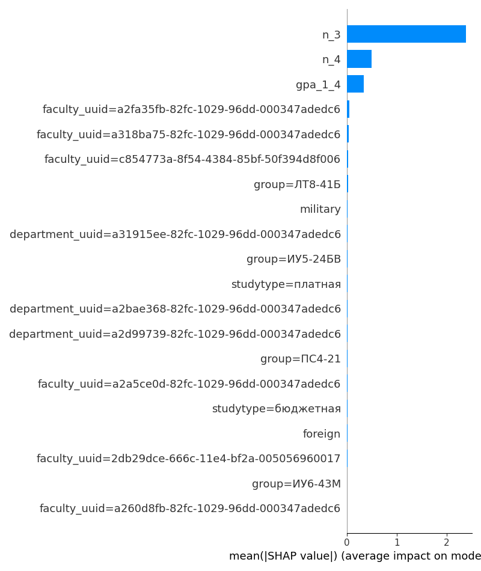

# Прогнозирование академической успешности студентов

Модель машинного обучения, которая по результатам первых четырёх семестров предсказывает, завершит ли студент обучение успешно: без отчисления и академического отпуска, с минимальным числом троек и четвёрок за 1–8 семестры.

Проект начат как выпускная квалификационная работа бакалавра в МГТУ им. Н. Э. Баумана (направление «Прикладная математика и информатика», кафедра ИУ9) и продолжается как дипломная работа в Центральном университете (направление «Математика и компьютерные науки»).

## Задача

Бинарная классификация на уровне студента:

- **признаки** собираются только по 1–4 семестрам: средний балл, число троек и четвёрок, несданные экзамены, наличие переносов/задолженностей, форма обучения, факультет, кафедра, группа, социальные признаки;
- **целевая переменная** `target = 1`, если к 8-му семестру студент не отчислен и не в академическом отпуске, и при этом за 1–8 семестры у него меньше 5 троек и меньше 15 четвёрок.

Валидация — `GroupKFold`, чтобы студенты одной группы/одного студента не попадали одновременно в обучение и проверку.

## Пайплайн

| Шаг | Скрипт | Результат |
|---|---|---|
| 1. Сборка датасета из выгрузок ЭИОС | `data_load.py` | `data/df_raw.parquet` |
| 2. Анализ условий целевой переменной | `cond.py` | статистика в консоли |
| 3. Признаки и препроцессор (OHE + sparse) | `feature_engineering.py` | `data/df_features.parquet`, `models/preprocess.joblib` |
| 4. Базовые модели: LogReg, XGBoost, LightGBM | `train_baseline.py` | `reports/metrics_baseline.csv`, `models/best_model.joblib` |
| 5. Подбор гиперпараметров LightGBM (Optuna), калибровка порога под recall ≥ 0.9, SHAP | `tune_and_interpret.py` | `models/best_model.joblib`, `models/final_threshold.json` |

Весь пайплайн по шагам запускается из ноутбука `diploma.ipynb`.

```bash
pip install -r requirements.txt
python data_load.py --root data/ --out data/df_raw.parquet
python feature_engineering.py --raw data/df_raw.parquet --out data/df_features.parquet --pipe models/preprocess.joblib
python train_baseline.py --data data/df_features.parquet --pipe models/preprocess.joblib
python tune_and_interpret.py --n-trials 40
```

Скрипты обучения настроены на GPU (`device="cuda"` для XGBoost, `device="gpu"` для LightGBM); без видеокарты эти параметры нужно убрать.

## Результаты

Базовые модели на отложенном фолде (`reports/metrics_baseline.csv`):

| Модель | ROC-AUC | PR-AUC | Precision | Recall | F1 |
|---|---|---|---|---|---|
| Logistic Regression | 0.990 | 0.875 | 0.762 | 0.915 | 0.832 |
| XGBoost | 0.999 | 0.988 | 0.898 | 0.997 | 0.945 |
| LightGBM | 0.999 | 0.987 | 0.914 | 0.980 | 0.946 |

Наибольший вклад в предсказание дают число троек и четвёрок за первые четыре семестра и средний балл:



## Данные

Исходные данные — обезличенные выгрузки из информационной системы университета (контингент, сессии, оценки, переносы, документы). Они содержат сведения о студентах, поэтому в репозиторий **не включены**, как и обученные модели. Скрипты ожидают CSV-файлы в папке `data/`: `students.csv`, `contingent.csv`, `diplom.csv`, `pass.csv`, `perenos.csv`.

## Автор

Иван Токарев
