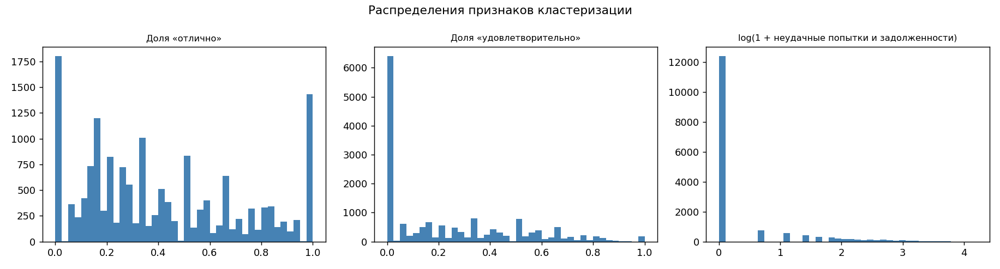
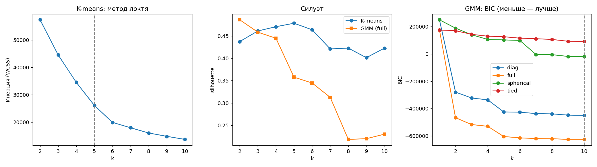
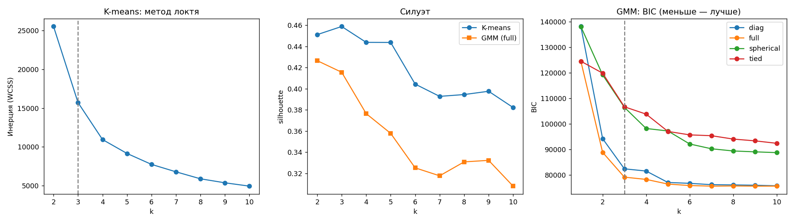
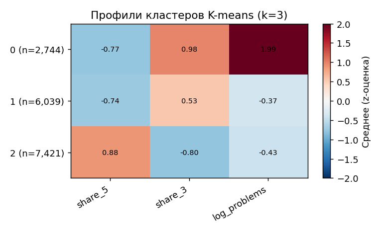
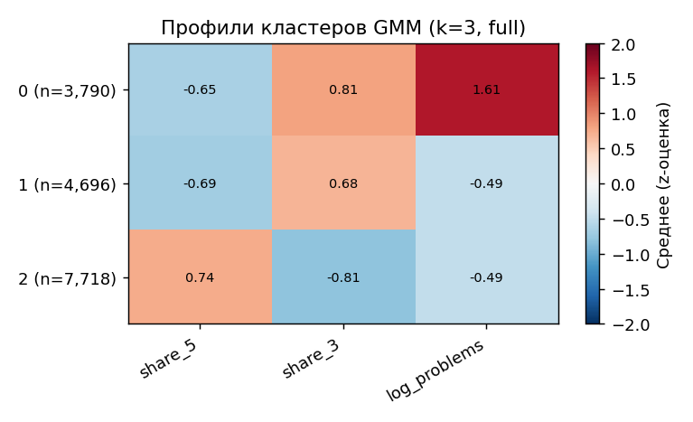
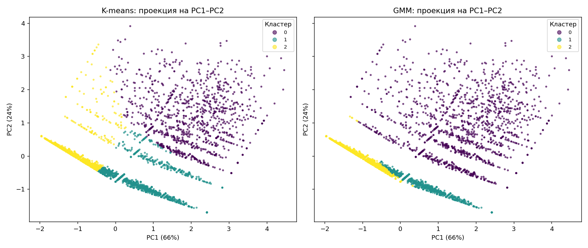
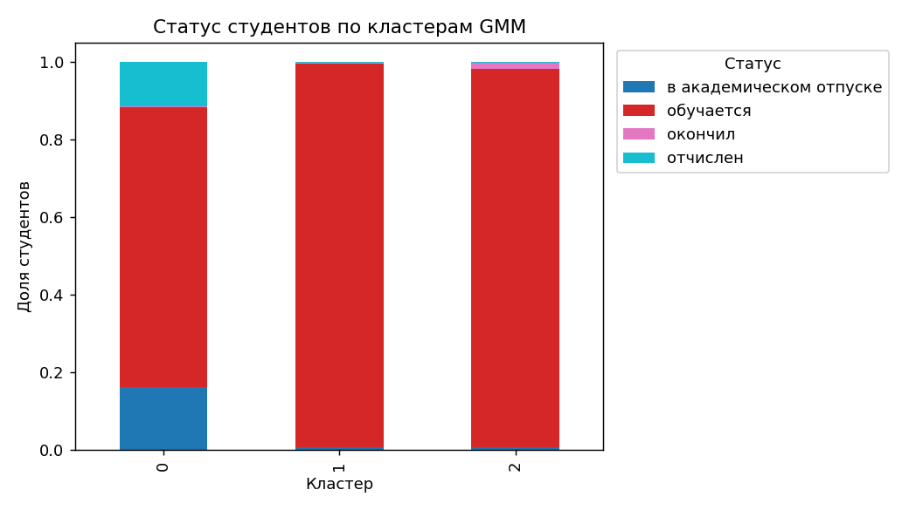
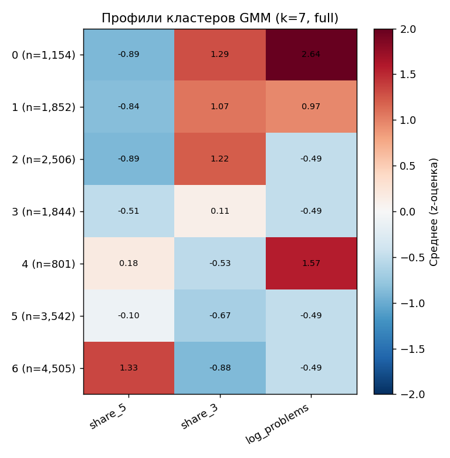

# Кластеризация студентов: K-means и EM-кластеризация (GMM)

**Задача 1.** Провести кластеризацию данных методами K-means и EM-алгоритма для смеси гауссовских распределений, оценить результат и ответить, можно ли считать кластеризацию удачной.

**Коротко.**
- Оба метода устойчиво выделяют **три группы студентов**. Около 17–23 % составляет группа с задолженностями и пересдачами, около 30–37 % учатся без долгов на «3–4», около 46–48 % — на «4–5».
- Самый практичный результат: в группе с задолженностями доля отчисленных и ушедших в академический отпуск в **4–4,5 раза выше** средней (28–32 % против 7 %). Эта группа покрывает 76–91 % всех таких студентов.
- Ярко выраженной кластерной структуры в данных нет. Студенты образуют **непрерывный спектр** по уровню оценок, на который наложены дискретные «слои» по числу пересдач. Отделение группы с задолженностями — реальная граница. Граница между «3–4» и «4–5» — условный разрез континуума.
- **Вывод:** кластеризация удачна как устойчивая и интерпретируемая **сегментация**. Как обнаружение естественных групп она удачна лишь частично.

Скрипт: [`clustering.py`](../../clustering.py). Запуск: `python clustering.py --k-gmm 3 --cov full`. Все числа ниже взяты из файлов этой папки.

---

## 1. Данные и признаки

**Объект кластеризации — студент.** Выборка: 18 592 студента из датасета дипломной работы, в который вошли данные за семестры 1–4. В анализ попали **16 204 студента**, у которых в 1–4 семестрах есть хотя бы 3 итоговые оценки за экзамены, дифференцированные зачёты, курсовые проекты и работы. Остальные 2 388 студентов почти не имеют оценок: 80 % из них — студенты 1-го курса. Среди исключённых непропорционально много отчисленных и академистов (304 и 343, всего 27 %). Это студенты, ушедшие до первой полноценной сессии. Кластеризация по оценкам их не описывает, и это ограничение анализа.

Статусы студентов в выборке:

| Статус | Студентов | Доля |
|---|---:|---:|
| обучается | 14 906 | 92,0 % |
| академический отпуск | 691 | 4,3 % |
| отчислен | 466 | 2,9 % |
| окончил | 141 | 0,9 % |

**Признаки строились заново по исходной таблице оценок `diplom.csv`.** Признаки из `df_raw.parquet` для кластеризации не подходят (подробнее в разделе 6). Итог по каждой дисциплине — последняя попытка сдачи. На этой основе посчитаны три признака:

| Признак | Смысл |
|---|---|
| `share_5` | доля оценок «отлично» среди итоговых оценок за экзамены, дифференцированные зачёты, КП и КР |
| `share_3` | доля оценок «удовлетворительно» |
| `log_problems` | log(1 + число неудачных попыток: неуд, неявка, недопуск, «не аттестован», включая позже исправленные) |

Признаки стандартизованы (z-оценки). Средний балл, долю сданных зачётов и прочие показатели **в кластеризацию не включены** и используются только для описания кластеров. Причины:
- средний балл на 98 % (R²) выражается через `share_5` и `share_3`, поэтому не добавляет информации и делает ковариацию в GMM почти вырожденной;
- доля сданных зачётов равна 1 почти у всех студентов.



У 84 % студентов `log_problems = 0`, то есть данные далеки от гауссовских. Это существенно для EM-кластеризации (см. раздел 2).

## 2. Первый эксперимент: что пошло не так

Первая версия использовала 6 признаков: средний балл, доли «5» и «3», долю сданных зачётов, число пересдач и число долгов. Учитывались только записи с `not_valid = 0`. Сохранённые результаты лежат в [`../clustering_v1_naive/`](../clustering_v1_naive/). Выявились три проблемы.

1. **Вырожденность GMM.** BIC монотонно падал до −625 000 и не имел минимума на k = 1…10. EM подгонял компоненты с почти нулевой дисперсией под точечные массы: «0 долгов» у 85 % студентов, «все зачёты сданы» у 99 %. Правдоподобие такой компоненты неограниченно растёт. Дело не в найденной структуре, а в нарушении предположения о непрерывности.
2. **Кластеры-выбросы.** Признак «доля сданных зачётов» почти константен, поэтому 1–2 % студентов со значением меньше 1 получали z-оценки до −12. И K-means, и GMM выделяли под них отдельные кластеры по 37–143 человека.
3. **Потеря отчисленных.** При отчислении записи об оценках помечаются `not_valid = 1`. Фильтр по этому флагу удалил **всех** отчисленных студентов, то есть как раз самую интересную группу.

Исправления: отбор признаков (раздел 1); итоговая оценка по последней попытке, без учёта `not_valid`; регуляризация ковариаций GMM (`reg_covar = 0.05` в z-единицах), которая не даёт компонентам сжиматься в точку.



## 3. Выбор числа кластеров



**K-means** (k = 2…10, 10 инициализаций k-means++):

| k | Силуэт | Davies–Bouldin |
|---|---:|---:|
| 2 | 0,451 | 0,957 |
| **3** | **0,459** | 0,835 |
| 4 | 0,444 | **0,785** |
| 5 | 0,444 | 0,889 |
| 6 | 0,404 | 0,925 |

Силуэт максимален при k = 3. Метод локтя указывает на k = 3–4. Выбрано **k = 3**.

**GMM** (k = 1…10; ковариации full, diag, tied, spherical). Лучшая форма ковариации — `full`. BIC при росте k:

| k | BIC | Изменение BIC | Силуэт | Средняя уверенность отнесения |
|---|---:|---:|---:|---:|
| 1 | 124 472 | — | — | 1,00 |
| 2 | 88 801 | −28,7 % | 0,426 | 0,96 |
| **3** | **79 087** | **−10,9 %** | 0,416 | **0,93** |
| 4 | 78 200 | −1,1 % | 0,376 | 0,89 |
| 5 | 76 370 | −2,3 % | 0,358 | 0,85 |
| 7 (мин. BIC) | 75 563 | — | 0,318 | 0,73 |

Формальный минимум BIC достигается при k = 7. Однако после k = 3 каждый следующий кластер улучшает BIC лишь на 0,3–2 %, а уверенность отнесения падает с 0,93 до 0,73. Начиная с k = 4 GMM не находит новые группы, а аппроксимирует негауссову форму распределения несколькими гауссианами. Это известное свойство BIC на больших выборках с негауссовыми данными. Поэтому основной вариант — **GMM с k = 3** (локоть BIC). Вариант с k = 7 разобран отдельно в разделе 5.

## 4. Результаты (k = 3)

### Профили кластеров

Кластеры упорядочены по среднему баллу. Средний балл, доли «4» и статус студента в кластеризации не участвовали.

**K-means:**

| Кластер | Студентов | Средний балл | Доля «5» | Доля «4» | Доля «3» | Неудачи, исправленные пересдачей | Действующие задолженности | Отчислен | Академ. отпуск |
|---|---:|---:|---:|---:|---:|---:|---:|---:|---:|
| 0 — с задолженностями | 2 744 (17 %) | 3,60 | 0,17 | 0,29 | 0,49 | 2,9 | 5,5 | **13,7 %** | **18,3 %** |
| 1 — «3–4» без долгов | 6 039 (37 %) | 3,80 | 0,18 | 0,44 | 0,38 | 0,0 | 0,1 | 1,0 % | 1,7 % |
| 2 — «4–5» без долгов | 7 421 (46 %) | 4,66 | 0,69 | 0,29 | 0,03 | 0,0 | 0,1 | 0,4 % | 1,1 % |

**GMM (full, EM):**

| Кластер | Студентов | Средний балл | Доля «5» | Доля «4» | Доля «3» | Неудачи, исправленные пересдачей | Действующие задолженности | Отчислен | Академ. отпуск |
|---|---:|---:|---:|---:|---:|---:|---:|---:|---:|
| 0 — с задолженностями | 3 790 (23 %) | 3,69 | 0,21 | 0,31 | 0,45 | 2,2 | 4,3 | **11,5 %** | **16,2 %** |
| 1 — «3–4» без долгов | 4 696 (29 %) | 3,78 | 0,20 | 0,39 | 0,41 | 0,0 | 0,0 | 0,3 % | 0,6 % |
| 2 — «4–5» без долгов | 7 718 (48 %) | 4,62 | 0,64 | 0,33 | 0,02 | 0,0 | 0,0 | 0,2 % | 0,6 % |




### Чем различаются методы

Метки двух методов согласуются хорошо: ARI = 0,69. Основное расхождение касается студентов с 1–2 неудачными попытками.
- K-means делит пространство по ближайшему центру. Таких студентов он относит к «благополучным» кластерам 1 или 2.
- GMM моделирует отдельную широкую компоненту с большой дисперсией по `log_problems`. В неё попадает **любой** студент с хотя бы одной неудачей. Поэтому кластер 0 у GMM больше (3 790 против 2 744), а кластеры 1 и 2 полностью «чистые» (0 долгов).

| K-means \ GMM | 0 | 1 | 2 |
|---|---:|---:|---:|
| 0 | 2 744 | 0 | 0 |
| 1 | 747 | 4 577 | 715 |
| 2 | 299 | 119 | 7 003 |



На проекции хорошо видна геометрия данных. Нижняя плотная «полоса» — студенты без неудач, вытянутые вдоль оси «пятёрки ↔ тройки». Параллельные полосы выше соответствуют 1, 2, 3… неудачным попыткам. Отдельных сгустков нет: кластеры 1 и 2 разрезают единую полосу.

### Связь со статусом студента

Статус в кластеризации не использовался, поэтому это внешняя проверка.



| | K-means, кластер 0 | GMM, кластер 0 | Вся выборка |
|---|---:|---:|---:|
| Доля отчисленных и ушедших в академический отпуск | 32,0 % | 27,7 % | 7,1 % |
| Превышение над средним (lift) | ×4,5 | ×3,9 | — |
| Какая часть всех таких студентов попала в кластер | 75,9 % | **90,8 %** | — |

В кластерах без задолженностей таких студентов 0,8–2,7 %. GMM лучше подходит для выделения группы риска: он «ловит» 91 % будущих отчисленных и академистов ценой более широкой группы.

Ограничение: связь частично механическая. Студент, ушедший в академический отпуск или отчисленный посреди сессии, получает неявки и «не аттестован», то есть задолженности. Чтобы делать прогноз, а не описывать уже случившееся, признаки нужно строить по семестрам **до** события. Это одно из направлений дальнейшей работы.

NMI между кластерами и статусом невелик (0,10–0,12). Это ожидаемо при 92 % студентов в статусе «обучается» и не противоречит выводу о сильном обогащении группы риска.

## 5. GMM с k = 7 (минимум BIC)



| Кластер | Студентов | Средний балл | Действующие задолженности | Отчислен + академ. отпуск |
|---|---:|---:|---:|---:|
| 0 | 1 154 | 3,51 | 7,8 | 32,9 % |
| 1 | 1 852 | 3,56 | 2,1 | 21,7 % |
| 4 | 801 | **4,28** | 4,4 | **33,6 %** |
| 2 | 2 506 | 3,58 | 0 | 0,9 % |
| 3 | 1 844 | 3,99 | 0 | 0,7 % |
| 5 | 3 542 | 4,32 | 0 | 0,8 % |
| 6 | 4 505 | 4,82 | 0 | 0,9 % |

Более мелкое разбиение даёт содержательное наблюдение. Есть кластер **хорошо успевающих студентов с задолженностями** (кластер 4, средний балл 4,28). Отчисляются и уходят в академический отпуск они так же часто, как слабые студенты с долгами (около 33 %). Среди студентов без долгов доля таких исходов меньше 1 % при любом среднем балле, от 3,6 до 4,8. Иначе говоря, **риск определяется наличием задолженностей, а не уровнем оценок**.

Само разбиение на 7 кластеров ненадёжно:
- средняя уверенность отнесения 0,73;
- бутстрэп-устойчивость ARI = 0,82, в худшем случае 0,67;
- четыре «чистых» кластера (2, 3, 5, 6) — это нарезка континуума по среднему баллу.

## 6. Можно ли назвать кластеризацию удачной

**Внутренние метрики (k = 3):**

| Метрика | K-means | GMM | Ориентир |
|---|---:|---:|---|
| Силуэт | 0,459 | 0,416 | по Kaufman & Rousseeuw: 0,26–0,50 — слабая структура, 0,51–0,70 — разумная |
| Силуэт на перемешанных данных* | 0,360 | — | случайная база |
| Davies–Bouldin | 0,83 | 0,93 | меньше — лучше |
| Устойчивость (бутстрэп ARI, 20 × 80 %) | 0,990 (мин. 0,958) | 0,995 (мин. 0,982) | > 0,9 — устойчиво |
| Средняя уверенность отнесения | — | 0,93 (у 14 % студентов < 0,8) | |
| Согласие методов (ARI) | 0,69 | 0,69 | |

\* Каждый признак перемешан независимо. Распределения признаков при этом сохраняются, а связи между ними разрушаются.

**Что удалось.**
- Разбиение воспроизводимо: устойчиво к подвыборкам, и два разных метода дают согласованный результат.
- Кластеры легко интерпретировать.
- Кластеры несут внешний смысл, проверенный на данных, которые в кластеризации не участвовали: группа с задолженностями концентрирует 76–91 % отчислений и академических отпусков.

**Что не удалось.**
- Силуэт 0,46 — это «слабая структура». Он лишь на 0,10 выше случайной базы, то есть заметная часть силуэта объясняется формой распределений отдельных признаков, а не группами студентов.
- Данные не являются смесью гауссиан. GMM при свободном выборе k уходит в аппроксимацию плотности (k = 7 с перекрывающимися компонентами) вместо выделения групп.
- Граница между «3–4» и «4–5» условна: это разрез непрерывной шкалы.

**Итог.** Как **сегментация** студентов кластеризация удачна: она стабильна, интерпретируема и выделяет группу риска. Как **обнаружение естественных групп** — удачна частично: реальна только граница «есть задолженности / нет задолженностей», остальное — непрерывный спектр успеваемости.

## 7. Попутные находки по данным

При построении признаков обнаружены проблемы в исходном пайплайне дипломной работы (`data_load.py`). Они влияют на основную модель классификации.

1. **«Зачтено» и «удовлетворительно» имеют один код оценки `3`.** В 1–4 семестрах около 78 % записей с кодом 3 — это зачёты. В результате признак `n_3` («число троек») — на самом деле в основном число сданных зачётов. Целевая переменная (`n_3_1_8 < 5`) тоже определяется в основном числом зачётов, а не троек. Этим объясняется и почти идеальное качество модели (ROC-AUC ≈ 0,999): целевая переменная почти напрямую вычисляется из признака `n_3`.
2. **`gpa_1_4` усредняет служебные коды** (перенос −3, не сдавал −1, «не аттестован» −4, неявка 1), поэтому это не средний балл. Минимальное значение −4.
3. **Каждый студент повторяется в `df_raw.parquet` в среднем 19 раз**: 356 675 строк на 18 592 студентов, это дубли от join с `diplom`. Признаки дублей одинаковые, но при обучении и подсчёте метрик студенты получают разный вес.
4. **Отчисленные студенты:** их оценки помечены `not_valid = 1`. Любой фильтр по этому флагу исключает их из анализа.

## 8. Что можно сделать дальше

- Исправить определение целевой переменной и признаков в основном пайплайне (п. 7) и пересчитать модель классификации.
- Для дискретных признаков (число пересдач и долгов) применить смеси, подходящие для счётных данных: пуассоновские смеси или латентно-классовый анализ, вместо гауссовской смеси.
- Добавить динамику по семестрам (тренд среднего балла, семестр первой задолженности) и строить признаки строго до события отчисления или академического отпуска.
- Использовать номер кластера, то есть вероятности GMM, как признак в модели прогнозирования.

## Воспроизведение

```bash
pip install -r requirements.txt
python clustering.py --k-gmm 3 --cov full        # основной вариант (этот отчёт)
python clustering.py                             # k выбирается автоматически: K-means — по силуэту, GMM — по BIC
```

Нужны файлы `data/diplom.csv` и `data/df_features.parquet`. Время работы — около 2 минут. Метки кластеров для каждого студента сохраняются в `data/cluster_labels.parquet`; этот файл не публикуется, так как содержит идентификаторы студентов. Результаты варианта GMM с k = 7 (файлы `*_bic_k7.*`) получены запуском без `--k-gmm`.
